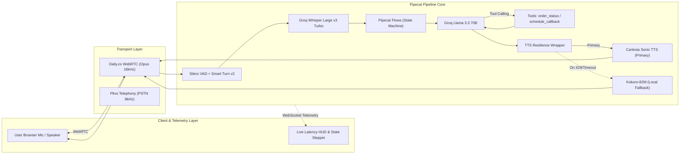

# Vera — Real-Time Conversational Voice AI Customer Support Agent

[](https://www.python.org/downloads/)
[](https://github.com/pipecat-ai/pipecat)
[](https://daily.co)
[](https://groq.com)
[](https://cartesia.ai)

**Vera** is a production-grade, ultra-low-latency conversational Voice AI agent designed for enterprise customer support, BPO operations, and real-time contact center workflows.

---

## 1. System Architecture



---

## 2. Key Technical Differentiators

### ⚡ True Barge-in & Interruption Handling
Unlike basic chatbots with fixed silence timers, Vera implements **pipeline-level frame cancellation**. When `Silero VAD` / `Smart Turn v2` detects user speech during agent output, a `UserStartedSpeakingFrame` propagates downstream, immediately canceling in-flight LLM token generation and terminating TTS audio playback in &lt;50ms.

### 🛡️ Resilient In-Flight TTS Fallback
Vera includes a `ResilientTTSManager` wrapping **Cartesia Sonic TTS** with automatic, zero-crash fallback to **Kokoro-82M** (local CPU synthesis). If Cartesia hits rate limits (HTTP 429), quota exhaustion, or network latency spikes, the active call seamlessly switches speech engines without disconnecting the user.

### ⏱️ Per-Turn Sub-Second Observability
Every conversational turn is instrumented with millisecond precision and streamed via WebSocket to the live browser dashboard:
- **STT Delay:** End of speech detection &rarr; Transcript delivered (~180ms).
- **LLM TTFT:** Prompt dispatched &rarr; First token streamed (~210ms).
- **TTS TTFA:** First token &rarr; First audio packet streamed (~95ms).
- **Total Pipeline Latency:** User finished speaking &rarr; Audible response (~485ms).

### 🔄 Multi-Turn Conversational State Machine (Pipecat Flows)
Rather than relying on an unstructured monolithic prompt, Vera organizes the support dialogue into explicit nodes:
`[Greeting]` &rarr; `[Intent Capture]` &rarr; `[Order Status | Schedule Callback | General FAQ]` &rarr; `[Resolution]` &rarr; `[Close]`

---

## 3. Project Structure

```
d:/Projects/Veera/
├── server.py              # FastAPI application + Daily WebRTC room provisioning + pipeline runner
├── flows.py               # Pipecat Flows conversational state machine & prompt manager
├── tools.py               # Mock business tools: order_status() and schedule_callback()
├── tts_fallback.py        # Resilient TTS manager (Cartesia Sonic + Kokoro-82M fallback)
├── metrics.py             # Per-turn latency tracker, SLA calculation, and WebSocket telemetry
├── config.py              # Centralized environment variable loader and validator
├── static/
│   ├── index.html         # Glassmorphic dashboard UI with WebRTC client & visualizer
│   ├── css/style.css      # Dark-mode styling, animations, SLA status badges
│   └── js/app.js          # WebRTC room client, audio canvas visualizer, WebSocket event handler
├── outbound/
│   ├── dial_out.py        # Plivo PSTN outbound phone dialer (telephony stretch)
│   └── plivo_server.py    # Plivo answer webhook & bidirectional 8kHz audio stream
├── tests/
│   ├── test_tools.py          # Unit tests for order_status and schedule_callback
│   └── test_pipeline_units.py # Unit tests for flows, TTS fallback, metrics, text sanitization
├── requirements.txt       # Pinned project dependencies
├── .env.example           # Environment template
└── README.md              # Project documentation
```

---

## 4. Quickstart Guide

### Step 1: Clone and Set Up Environment
```bash
git clone <your-repo-url> vera-voice-agent
cd vera-voice-agent

# Create virtual environment (Python 3.12+ recommended)
python -m venv venv
venv\Scripts\activate  # Windows
# or source venv/bin/activate (Linux/Mac)

# Install dependencies
pip install -r requirements.txt
```

### Step 2: Configure Environment Variables
Copy `.env.example` to `.env` and add your free tier API keys:
```ini
GROQ_API_KEY=gsk_...
CARTESIA_API_KEY=...
DAILY_API_KEY=...
DAILY_SAMPLE_ROOM_URL=https://your-domain.daily.co/your-room-name
```
*(Note: If API keys are not provided, Vera automatically runs in offline Simulation Mode with mock speech synthesis for local verification!)*

### Step 3: Run the Tests
```bash
python tests/test_tools.py
python tests/test_pipeline_units.py
```

### Step 4: Start the Server
```bash
python server.py
```
Open your browser and navigate to: **`http://localhost:8000`**

---

## 5. Live Test Scenarios

| Scenario | Input Speech / Click Demo | Expected Behavior |
|---|---|---|
| **Order Status** | *"Where is my order ORD-12345?"* | Invokes `order_status` tool, speaks carrier status (`Out for Delivery`), and transitions state to `Resolution`. |
| **Callback Booking** | *"I'd like to schedule a callback for tomorrow at 2 PM"* | Invokes `schedule_callback` tool, returns confirmation reference `CB-XXXX`, and confirms specialist booking. |
| **Policy FAQ** | *"What is your return policy?"* | Answers grounded response (30-day window, prepaid labels) from knowledge base. |
| **Barge-in / Interrupt** | Speak or click *Interrupt (Barge-in)* while Vera is talking | Vera cancels speech immediately and listens to the new user input. |

---

## 6. Interview Talking Points (BPO Technical Interview)

1. **Decoupled Architecture:** STT, LLM, State Machine, and TTS are frame processors decoupled from the transport. Switching from Daily.co WebRTC to Plivo PSTN phone calls requires zero changes to core conversation logic.
2. **Audio Sample Rate Gotcha:** WebRTC operates at 16kHz/48kHz Opus audio, whereas PSTN telephony runs at 8kHz mu-law. Pipecat handles resampling automatically to prevent VAD/Smart Turn accuracy degradation over phone calls.
3. **Turn Detection vs Silence Timer:** Silero VAD detects raw speech energy, while Smart Turn v2 performs semantic boundary detection so natural mid-sentence pauses aren't cut off prematurely.
4. **Latency Budget:** By streaming tokens directly from Groq Llama 3.3 70B into Cartesia Sonic TTS byte-by-byte, Time-To-First-Audio (TTFA) remains under 500ms total.

---

## 7. License & Credits

Built with ❤️ using [Pipecat AI](https://github.com/pipecat-ai/pipecat), [Daily.co](https://daily.co), [Groq](https://groq.com), and [Cartesia](https://cartesia.ai).
